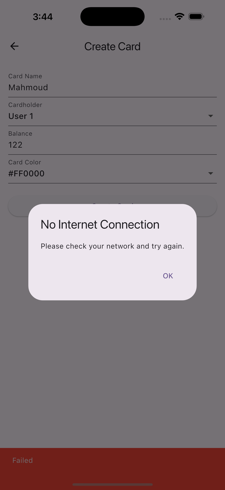

# Pemo Flutter Assignment  

## Overview  
This Flutter application is designed to help customers easily navigate their card transactions and view transaction details. The app includes features such as:  

- Multi-step form for creating cards.  
- Transaction details page to display detailed transaction data.  
- Local data persistence using Hive for offline functionality.  
- State management using BLoC with Cubit.  
- The app adheres to Clean Architecture principles and uses modern engineering practices for scalability and maintainability.  

## Features  

### Create Card:  
- **Step 1**: Input "Card Name" (validated for English characters, minimum 3 characters) and "Cardholder" (select a user).  
- **Step 2**: Input "Balance" (integer value between 100 and 1000).  
- **Step 3**: Allow the user to select a "Card Color."  

### Transaction Details Page:  
- Fetch and display detailed transaction data using a mock API.  

### Multiple Accounts :  
- Support multiple accounts, where each profile maintains its own cards and transactions.  

## Screenshots

### Create Card Screen

### Transaction Details Screen

### Card List Screen

### Multi-Account Support

### Netowrk-Connection

## Technologies Used  
- **Flutter**: For building the mobile app.  
- **BLoC with Cubit**: For state management.  
- **Hive**: For local data persistence.  
- **get_it**: For dependency injection.  
- **Mock API**: For simulating transaction data.  

## Setup Instructions  

### 1. Clone the Repository  
\`\`\`bash
git clone https://github.com/MahmoudElfooly/pemo-flutter-assignment.git
cd pemo
\`\`\`  

### 2. Install Dependencies  
Run the following command to install all dependencies:  
flutter pub get

### 3. Run the Mock API  
⚠️⚠️⚠️**To use the mock API, navigate to the mock API directory and run:  
dart run /AppPath/mokApi/mock_api.dart

**Important:** Ensure this is the last command running in the terminal. 
The mock API must remain active while using the app.**  ⚠️⚠️⚠️

### 4. Run the Flutter App  
Open a new terminal window and run:  
flutter run

## Project Structure  
The project follows **Clean Architecture** principles:  

- **Domain Layer**: Contains business logic and core entities.  
- **Data Layer**: Handles data storage and retrieval using a repository pattern.  
- **Presentation Layer**: Implements the user interface using Flutter widgets.  

### Key Files  
- \`lib/domain/entities/\`: Contains core entities like \`CardEntity\` and \`TransactionEntity\`.  
- \`lib/data/repositories/\`: Contains repository implementations for data handling.  
- \`lib/presentation/bloc/\`: Contains BLoC/Cubit files for state management.  
- \`lib/presentation/pages/\`: Contains UI screens like \`CreateCardPage\` and \`TransactionDetailsPage\`.  

## Testing  
The app includes **unit tests** to validate business logic and critical functions. To run tests:  
flutter test

## Future Improvements  
- **Multiple Accounts**: Each profile maintains its own cards and transactions.  
- **Enhanced UI/UX**: Improve interface with animations and transitions.  
- **API Integration**: Replace the mock API with a real backend.  
- **Offline Sync**: Implement offline data synchronization with a backend service.  

## Evaluation Criteria  
- **Software Design Patterns & Principles**: Effective use of Clean Architecture and BLoC with Cubit.  
- **Scalability & Extensibility**: The app should allow future expansion.  
- **Code Quality & Maintainability**: Clean, readable, and structured code.  
- **Functionality Completeness**: Full implementation of required features.  
- **Testing Coverage & Reliability**: Comprehensive unit tests.  
- **User Experience (UX)**: Intuitive navigation and smooth UI.  

## Important Notes  
- **Mock API**: Ensure it’s running before using the app:  
  dart run /AppPath/mokApi/mock_api.dart
-**Local Data Persistence**: The app uses **Hive**, allowing data to persist even when offline.  

## Contact  
For questions or issues, contact:  

**Author Mail**: mahmoudelfooly2@gmail.com.com  
**GitHub Repository**: [Pemo](https://github.com/MahmoudElfooly/pemo)  

🚀 Thank you for using the Pemo Flutter Assignment app! 🚀  
